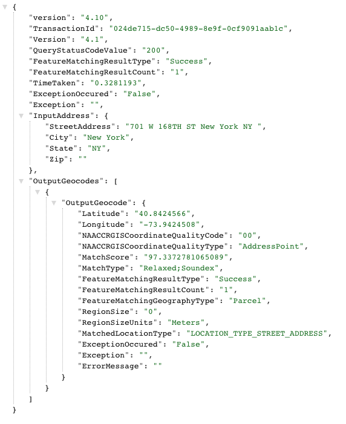
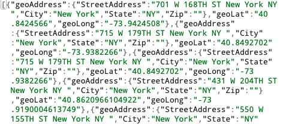
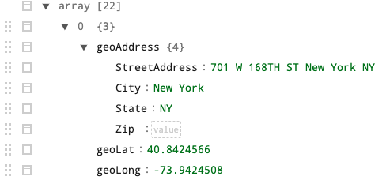

# Week 03 Assignment 

This week's assignment focuses on using Texas A&M GeoServices to obtain the 
latitude and longitude coordinates for the addresses we parsed last week. I began
by creating a new week03.js file and incorporated the started code provided.

When working with the API, an API key was needed. To keep this safe while still
being able to reference it, I saved it in a .env file and included .env in a 
.gitignore file.

Starter Code:
```
// dependencies
var request = require('request'); // npm install request
var async = require('async'); // npm install async
var fs = require('fs');
const dotenv = require('dotenv'); // npm install dotenv

// TAMU api key
dotenv.config();
const apiKey = process.env.TAMU_KEY;

// geocode addresses
var meetingsData = [];
var addresses = ["63 Fifth Ave", "16 E 16th St", "2 W 13th St"];

// eachSeries in the async module iterates over an array and operates on each item in the array in series
async.eachSeries(addresses, function(value, callback) {
    var apiRequest = 'https://geoservices.tamu.edu/Services/Geocode/WebService/GeocoderWebServiceHttpNonParsed_V04_01.aspx?';
    apiRequest += 'streetAddress=' + value.split(' ').join('%20');
    apiRequest += '&city=New%20York&state=NY&apikey=' + apiKey;
    apiRequest += '&format=json&version=4.01';
    
    request(apiRequest, function(err, resp, body) {
        if (err) {throw err;}
        else {
            var tamuGeo = JSON.parse(body);
            console.log(tamuGeo['FeatureMatchingResultType']);
            meetingsData.push(tamuGeo);
        }
    });
    setTimeout(callback, 2000);
}, function() {
    fs.writeFileSync('data/first.json', JSON.stringify(meetingsData));
    console.log('*** *** *** *** ***');
    console.log('Number of meetings in this zone: ');
    console.log(meetingsData.length);
});
```
I created a version of my week02 .json file with only the street addresses & 
commenting out the building name etc. I then read the file and parsed the data.
I used a for-loop to go through the addresses in the week2 .json file.
Knowing I'd need to save the geo location data in an array, I initialized an 
empty array called meetingsData that I can push the final data into.

```
var data = fs.readFileSync('wk2_StreetAddressesOnly_m010.json');
data = JSON.parse(data);


/* Initializing an empty array called meetingsData to later push locationData 
from tamuGeo into. Using a for loop to loop through the addresses in the week 2 
JSON file. */
var meetingsData = [];
let addresses = [];
for(var i = 0; i < data.length; i++) {
    addresses.push(data[i].streetAddress);
}
```

Using async.eachSeries allowed me to make the api request, splitting and joining
the street address to fit into the url. By using setTimeout, I'm able to work 
around the asyncronicity of javascript.

I created a variable called locationData to select the address, the latitude, 
and the longitude from the API json body. I then pushed the locationData into the 
array meetingsData and wrote a new file stringifying meetingsData containing the 
requested information for the assignment. The final product is an array of 
objects containing the street address, latitude and longitude for the meeting in 
zone 10.

```
async.eachSeries(addresses, function(value, callback) {
    var apiRequest = 'https://geoservices.tamu.edu/Services/Geocode/WebService/GeocoderWebServiceHttpNonParsed_V04_01.aspx?';
    apiRequest += 'streetAddress=' + value.split(' ').join('%20');
    apiRequest += '&city=New%20York&state=NY&apikey=' + apiKey;
    apiRequest += '&format=json&version=4.01';
    
        request(apiRequest, function(err, resp, body) {
        if (err) {throw err;}
        else {
            var tamuGeo = JSON.parse(body);
            var locationData = {
                geoAddress: tamuGeo['InputAddress'],
                geoLat: tamuGeo['OutputGeocodes'][0]['OutputGeocode']['Latitude'],
                geoLong: tamuGeo['OutputGeocodes'][0]['OutputGeocode']['Longitude']
            };
            console.log(tamuGeo["FeatureMatchingResultType"]);
            meetingsData.push(locationData);
        }
    });
    
        setTimeout(callback, 2000);
}, function() {
    fs.writeFileSync('GeolocationData10.json', JSON.stringify(meetingsData));
    console.log('*** *** *** *** ***');
    console.log('Number of meetings in this zone: ');
    console.log(meetingsData.length);
});
```
This is what the full body json looks like when requesting an address. From here
I determined which key:value pairs I wanted to access and where they were 
located within the json structure.


I pulled the .JSON file into jsonbeautifier.org to examine the file more easily.
Below are screenshots of a section of the file before and after the beautification.




