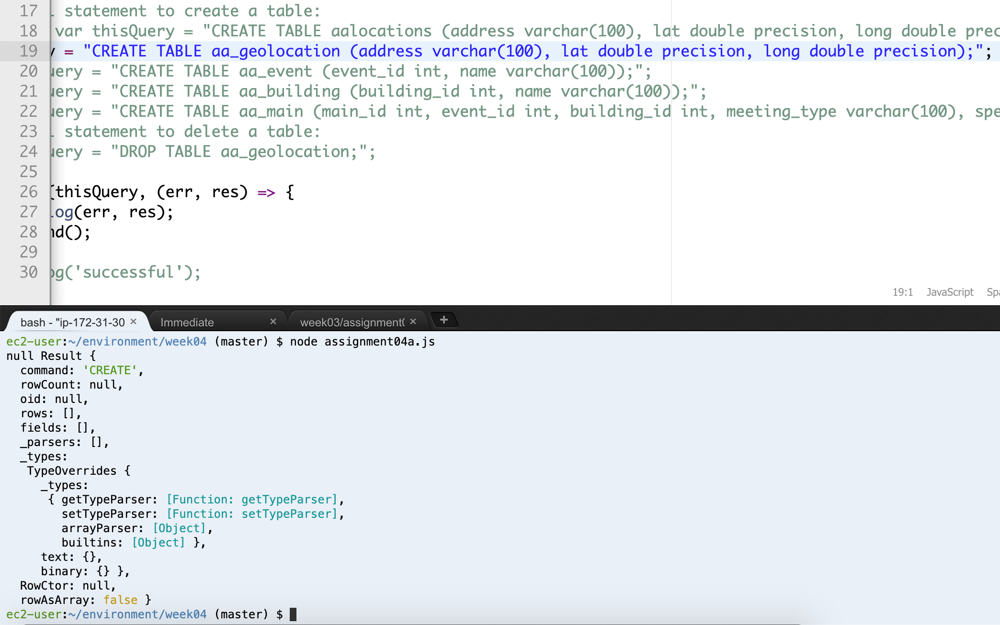
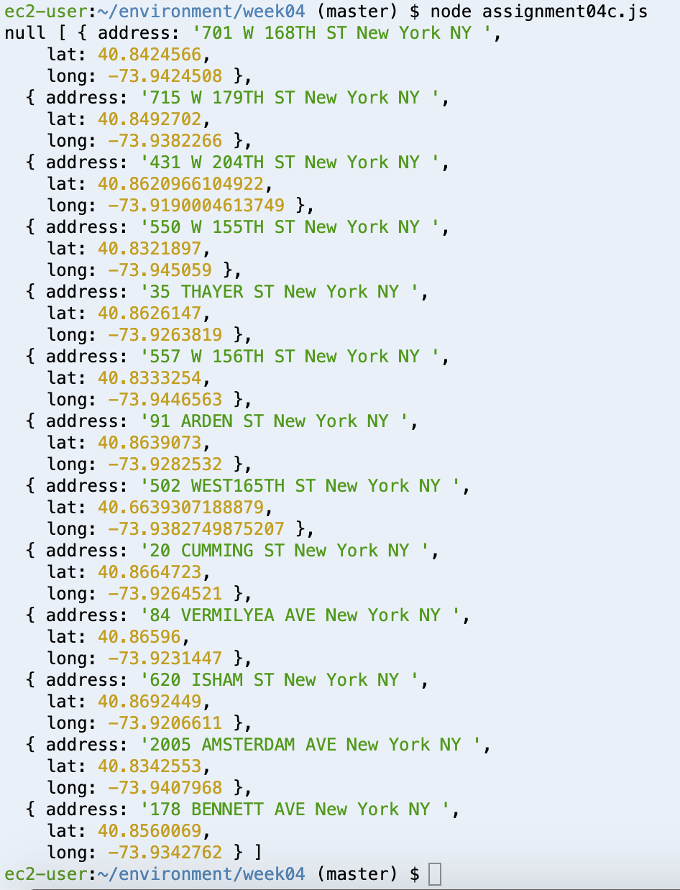

# Week 04 Assignment 

For this week's assignment, we're creating SQL database tables and populating 
the location table with our zone geolocation information that we have gathered.

In order to complete this task, we first set up a PostgreSQL database server 
hosted on AWS. We again use .env to keep our passwords private.

The starter code provided includes upfront details for the PostgreSQL server, 
a template to build from on how to create and drop tables, how to populate a 
table with content from an array, and how to chekc our work.

First, I used a for loop to go through the .json file of lats and longs from 
last week's assignment and include only the unique locations in a new array. 
I used this array moving forward when populating my geolocation table.

```
var content = fs.readFileSync('/home/ec2-user/environment/week03/GeolocationData10.json');
content = JSON.parse(content);
// console.log(content.length);

// var addressesForDb = [ { address: '63 Fifth Ave, New York, NY', latLong: { lat: 40.7353041, lng: -73.99413539999999 } }, { address: '16 E 16th St, New York, NY', latLong: { lat: 40.736765, lng: -73.9919024 } }, { address: '2 W 13th St, New York, NY', latLong: { lat: 40.7353297, lng: -73.99447889999999 } } ];
var addressesForDb = [];
var addressesCheck = [];
// Create new array that has no duplicate locations from last week's assignment.
for (var i = 0; i < content.length; i++) {
    var latLonCombined = content[i]['geoLat'] + content[i]['geoLong'];
    if (addressesCheck.includes(latLonCombined) == false) {
        addressesForDb.push(content[i]);
        addressesCheck.push(latLonCombined);
    }
}
```

Here is an example of one of my created tables:
```
var thisQuery = "CREATE TABLE aa_event (event_id int, name varchar(100));";
```




I then used INSERT INTO to populate my geolocation table with the Zone 10 location
information I have parsed and ready.

```
async.eachSeries(addressesForDb, function(value, callback) {
    const client = new Client(db_credentials);
    client.connect();
    var thisQuery = "INSERT INTO aa_geolocation VALUES (E'" + value.geoAddress.StreetAddress + "', " + value.geoLat + ", " + value.geoLong + ");";
    client.query(thisQuery, (err, res) => {
        console.log(err, res);
        client.end();
    });
    setTimeout(callback, 1000); 
}); 
```
Lastly, I checked my work:
```
var thisQuery = "SELECT * FROM aa_geolocation;";

client.query(thisQuery, (err, res) => {
    console.log(err, res.rows);
    client.end();
});
```

Shown in this beautiful console log:


