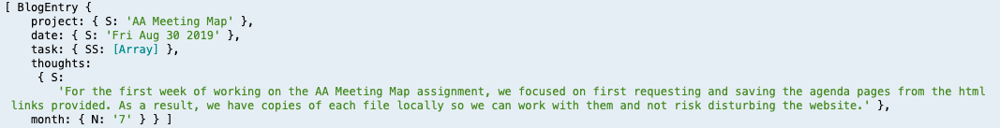
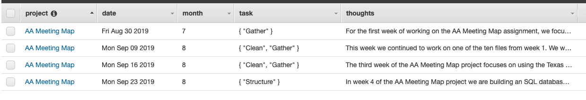

# Week 05 Assignment 

This week, we started a new project: Process Blogs. We are using a noSQL format 
and working with AWS service DynamoDB to format our databases. 

I chose to use the project name for my primary key (ex. AA Meeting Map) and date
as my sort key. In addition to these two, I added objects to log the task type 
(ex. Gather, Clean, Structure, Visualize), and add a write up of my thoughts from
that week's assignment. In the future, I hope to include inspiration as well and 
therefore included an object section for including strings related to inspo (ex. 
links, write ups, images).

I tested to make sure the format of the entry looked correct before pushing it 
to the database. Below is a visual of the test console log:

I used AWS SDK to add the blog entries to my Dynamo database. By utilizing the 
async.forEach function with a callback set to 1000, I can loop through the 
entries with no errors.

Final view of items in the database:

