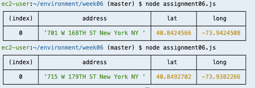
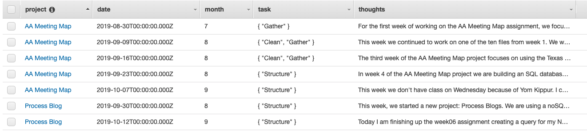
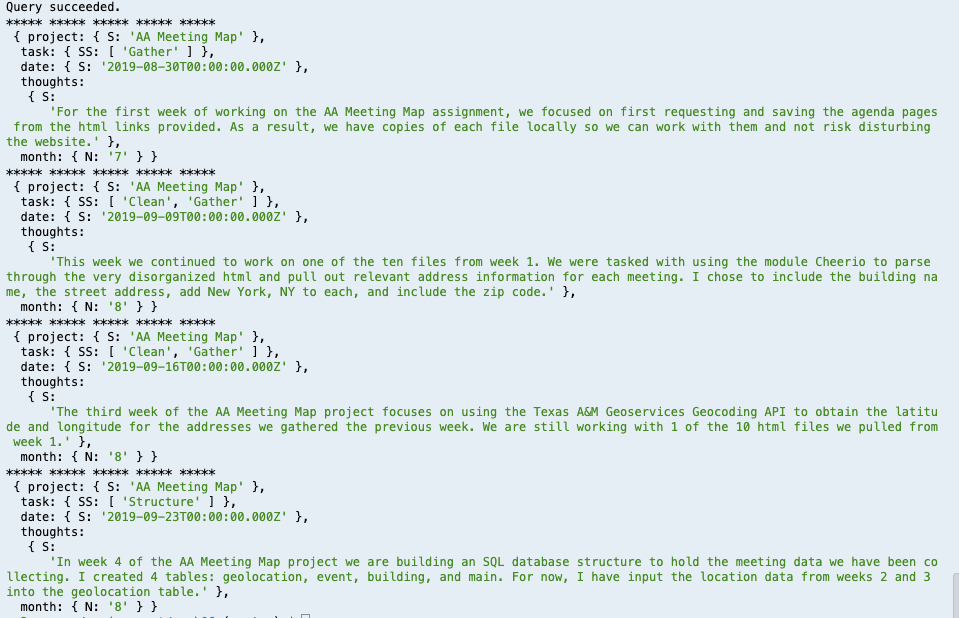

# Week 06 Assignment 

This week we are writing queries to both our SQL and NoSQL databases. These
tasks are split into part 1 and part 2.

Part 1: SQL Query for AA Map Project
I am using the geo-location table I created and populated on week 4 to write a
query. I plan do complete the rest of the parsing for the other information for 
Zone 10, and then all parsing for all zones by next week. For now, I am focusing 
on a simple query with the information I already have.

I used this query code to console log the below result:
```
var thisQuery = "SELECT address, lat, long FROM aa_geolocation WHERE address = 
'715 W 179TH ST New York NY ';";
```




Part 2: NoSQL Query for Process Blog
For this assignment, I went back to week05 and set my date string to be .toISOString
in order to be able to query results. Here is the view of the updated datatable:




I used the code below for my query, and yielded a successful response:

```
var params = {
    TableName : "ProcessBlogAAY",
    KeyConditionExpression: "#project = :project and #date between :minDate and :maxDate", // the query expression
    ExpressionAttributeNames: { // name substitution, used for reserved words in DynamoDB
        "#project" : "project"
        ,"#date" : "date"
    },
    ExpressionAttributeValues: { // the query values
        ":project": {S: "AA Meeting Map"},
        ":minDate": {S: new Date("2019-08-30").toISOString()},
        ":maxDate": {S: new Date("2019-09-23").toISOString()}
    }
};
```



