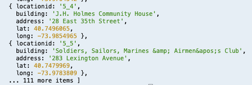
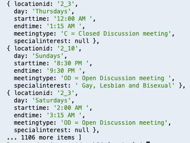

# Week 07 Assignment

This week was a doozy! We actually had about 2 weeks to work through it as we 
were tasked with parsing all relevant information for all 10 AA zones and inserting
the .json data into SQL tables.
I ended up creating two tables total, linking them on a location ID in both. The 
first table is a location table containing the location ID, building name, street 
address, latitude, and longitude. When inserting into the SQL table, I compared the 
latitude and longitude coordinates and removed any duplicates. 

Once all the information for location was collected in .json files and organized 
by zone, I used code from the week04 assignment to create a new table and insert 
into that new table. Below is an * all query of the table:

The second table is an event table containing time information like the day of the 
week, the start time, the end time, as well as the meeting type and special interest 
details and of course the location ID again to be able to join the tables appropriately.
For this table, it was very helpful to reference what was working for some of my 
classmates, and I ended up utilizing Lulu's solution as I was struggling to loop 
through and create objects within an object as well as connect to the location ID.

After all event .json files were ready to go, I created a new aa_event SQL table 
and inserted the .json objects for all zones into it. To test my results I made 
an * all query shown here:

I am looking forward to working on the upfront interface design in the following weeks!