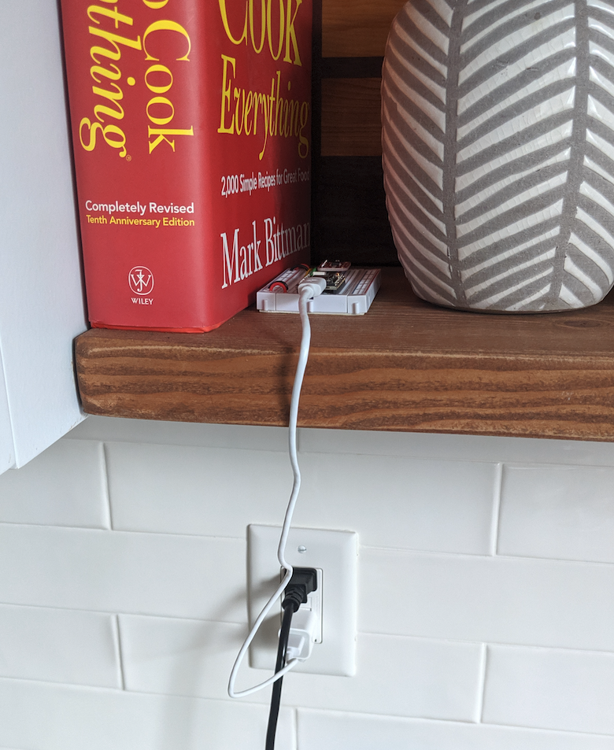
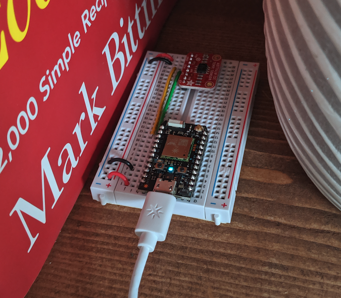
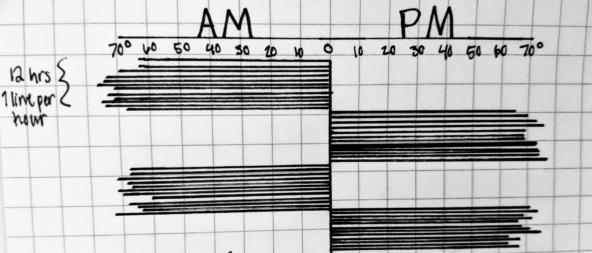
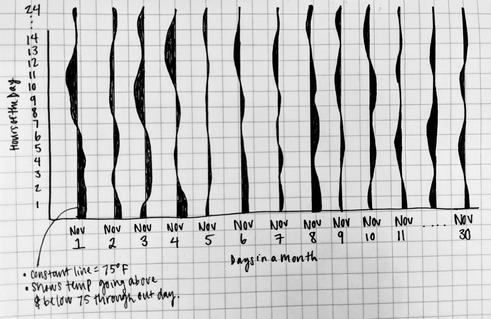

# Week 08 Assignment

For week 8 we assembled temperature sensors using Particle.io hardware. After 
soldering the sensor and wiring it to the bread board, I then verified that it 
accurately read the temperature. I placed mine in the kitchen next to my electic 
kettle - I hope to record when the temperature rises from kettle steam in the morning 
when I make coffee and at night when I make herbal tea. I'm not sure if that specific 
of a change will be able to be recorded, so I will also consider the variation that 
this placement being near the bathroom, front door entry, and a shady window will 
allow. Sketches and descriptions are below placement images.

Sketch concept 1:
This concept will have 12 lines drawn on either side of a middle line dividing AM 
hours from PM hours to have 24 lines for each day. The length of the horizontal 
lines will correlate with the temperature, the longer the line, the higher the 
temperature. The visualization will incorporate 30 days worth of lines. Two days 
worth are shown in sketch below.

Sketch concept 2:
Concept 2 will set a threshold temperature (tbd based on data, consider 75 degrees) 
and line will flow on either side of that threshold over 24 hours throughout a day. 
Each day will have a unique line & flow, and total visualization will show 30 days 
worth of data. The goal is to see how often the temperature is above or below the 
threshold, and if it is commonly above or below at the same times of day. I may end 
up using color to help distinguish the shading on either side of the threshold line.

