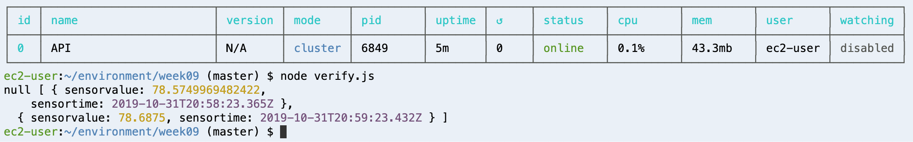

# Weeks 08 & 09 Assignments

For week 8 we assembled temperature sensors using Particle.io hardware. We soldered 
our sensors and and wired them to our bread boards. We then verified that it 
accurately read the temperature. I placed mine in the kitchen next to my electic 
kettle - I hope to record when the temperature rises from kettle steam in the morning 
when I make coffee and at night when I make herbal tea. 

For week 9, I set up a database using PostgreSQL to record the sensor value 
(temperature) and the datetime. I have it recording ever minute because of the short 
timespan in which the kettle will impact temperature. Below are a couple of screen 
shots showing the database setup and logs.

