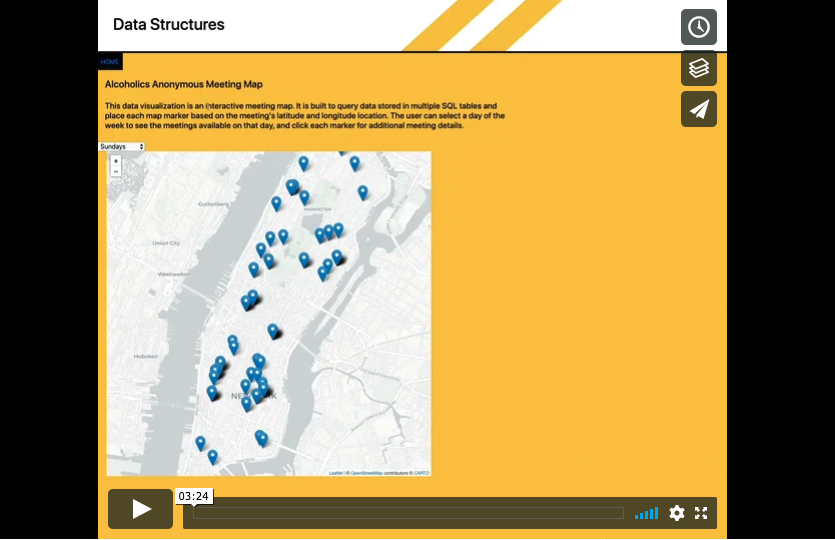
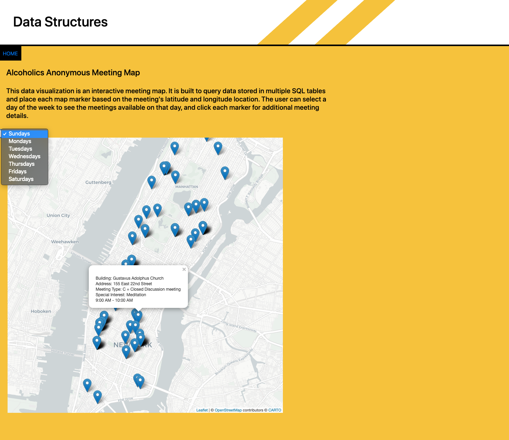
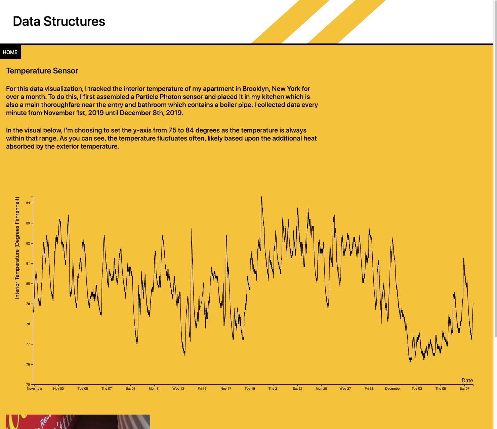
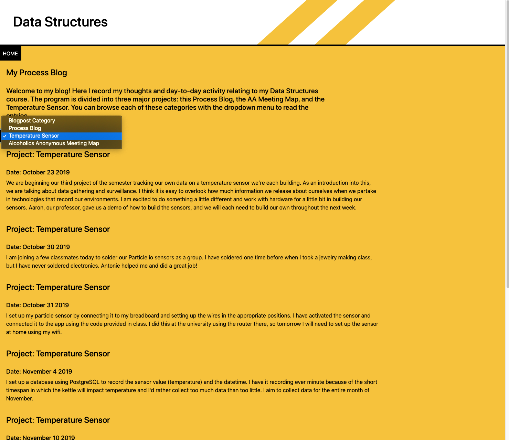

# Data Structures Final Projects
## AA Meeting Map, Temperature Sensor, & Process Blog
Fall 2019

The final project for Data Structures brought our full semester of gathering, cleaning, 
and structuring data to a culmination by creating usable interfaces for our three 
projects.

Visit my url: http://54.196.189.175:8080/

## See the video walkthrough of my final site:

### Alcoholics Anonymous Meeting Map:
This project spanned nearly the total length of the semester beginning with parsing 
addresses of a single zone of meetings, to structuring SQL databases for the total 
cleaned meeting data to be stored in. For week to week progress on this project, review
README documents within this repository.

The final product displays a meeting map that can be filtered by day of the week, 
with map markers that can be selected to display the building name, address, meeting 
type, any special interests (ex. LGBTQ), and the start and end times for each meeting.
To do this, I used SQL, JavaScript (including jQuery & AJAX), Leaflet, HTML and CSS.

### Temperature Sensor:
For this project, we were tasked with collecting our own data. We began by building 
our own temperature sensors using Particle photon sensors and connecting them within our 
apartments to log the temperature every minute (up to every five minutes) for at least 30 days.
I stored this large volume of data in an SQL table, which I then queried in the creation of 
this D3.js line graph.

### Process Blog:
The process blog allowed me the opportunity to build and update data within a Dynamo 
Database NoSQL structure. I chose to organize my blog using the project type as a primary 
key and the date as a sorting method. I structured the data for my interface using Handlebars, 
allowing for consistent formatting for each entry.

Completing the Data Structures course at Parsons School of Design has provided me with 
very valuable skills surrounding the gathering, cleaning, and structuring of data. I have 
a great respect for well organized systems and thoughtful interface design.
